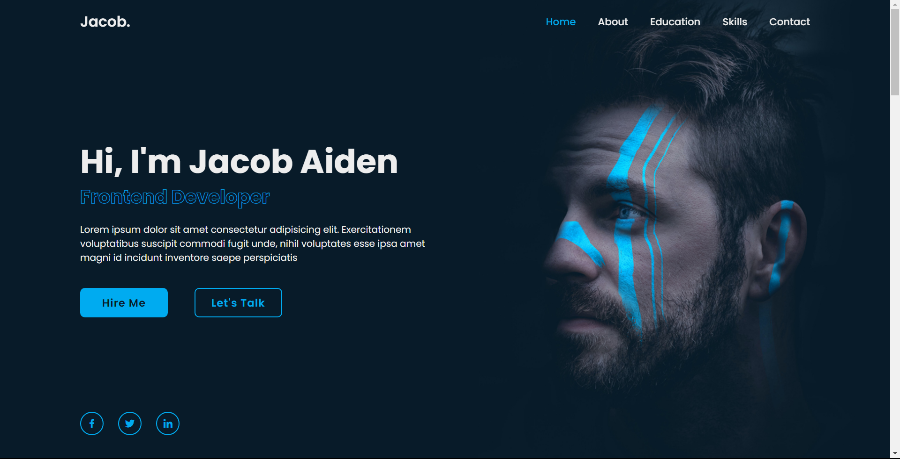
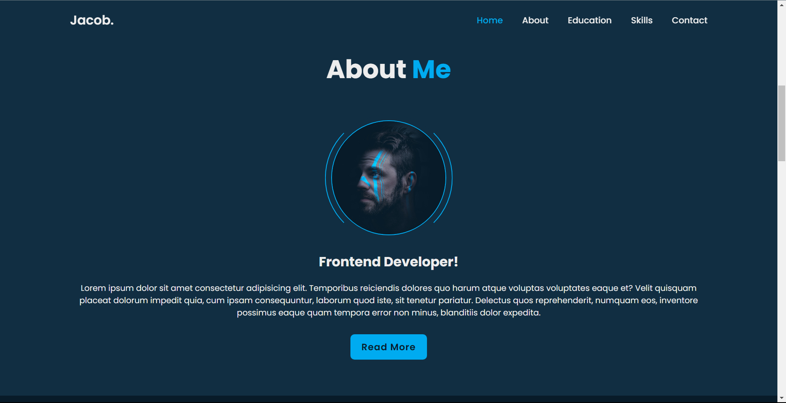
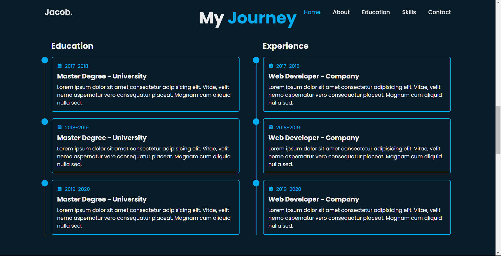
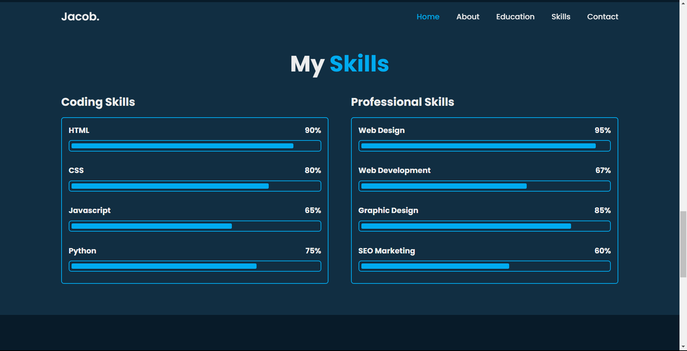

# Jacob Aiden - Portfolio Website



## Introduction

Welcome to the GitHub repository for Jacob Aiden's Portfolio Website! This project showcases the skills and projects of a Frontend Developer named Jacob Aiden. The website is created solely using HTML, CSS, and JavaScript. The portfolio website is designed to be responsive and visually stunning, providing visitors with a seamless experience across various devices.

Visit the live website: [Jacob Aiden Portfolio](https://anton-ovod.github.io/Jacob_Aiden_Portfolio/)

## Table of Contents

- [Introduction](#introduction)
- [Features](#features)
- [Technologies Used](#technologies-used)
- [Installation](#installation)
- [Usage](#usage)
- [Screenshots](#screenshots)
- [Contributing](#contributing)
- [License](#license)

## Features

The Jacob Aiden Portfolio Website includes the following sections:

1. **Home Section**: The landing page that gives an overview of Jacob Aiden and introduces visitors to his work and skills.

2. **Education Section**: Displays details about Jacob Aiden's educational background and professional experience.

3. **Skills Section**: Highlights the various technical skills possessed by Jacob Aiden, which showcases his expertise in Frontend Development.

4. **Contact Section**: Provides visitors with a means to get in touch with Jacob Aiden for potential collaboration or inquiries.

## Technologies Used

The portfolio website is developed using the following technologies:

- HTML5
- CSS3
- JavaScript

## Installation

To run the portfolio website locally on your machine, follow these steps:

1. Clone the GitHub repository to your local machine:
   ```
   git clone https://github.com/anton-ovod/Jacob_Aiden_Portfolio.git
   ```
2. Open the `index.html` file in your web browser.

## Usage

Once the website is loaded, navigate through the different sections to explore Jacob Aiden's portfolio, education, skills, and contact details. The website is designed to be intuitive and responsive, ensuring a seamless experience for users on all devices.

## Screenshots





## Contributing

Contributions to improve and enhance the portfolio website are always welcome! If you find any bugs, have suggestions, or want to add new features, please feel free to submit a pull request.

## License

This project is licensed under the [MIT License](LICENSE).
---

Thank you for visiting this repository and checking out the Jacob Aiden Portfolio Website! I hope you enjoy exploring the projects and skills showcased here. Feel free to use this project as a reference to showcase your web development skills. Happy coding!
